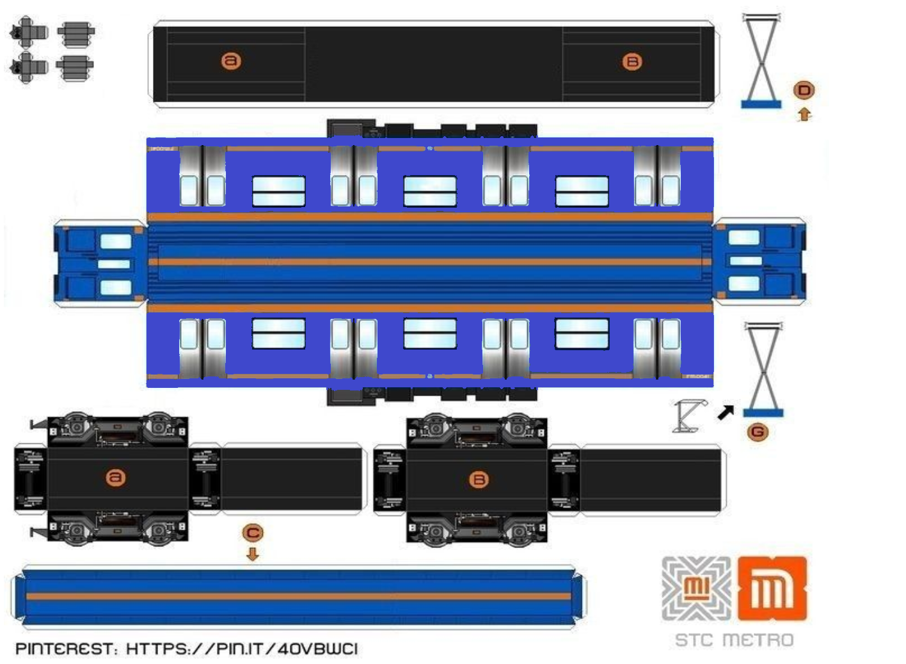

# Comandos basicos de Markdown

Aqui se explican los comandos basicos de Markdown

- La sintaxis para poner un subtitulo es \### subtitulo ejemplo:
    ### Subtitulo de Markdown

- Para dar formato de **negritas** y *cursiva* se utiliza la siguiente sistesis:  
\**negritas**   
\*cursiva*

- Si quieres que una palabra o frase esten en ***negrita y crusiva*** al mismo tiempo ocupas la siguiente sintesis:  
\*\*\*negrita y cursiva***
- Tambien podemos realizar hasta 6 diferentes tipos de encabezado, los cuales su variante es el tamaño de letra, a continuacion se muestran los difentres tipos de encabezados:  
   # Encabezado 1 
   ## Encabezado 2  
   ### Encabezado 3
   #### Encabezado 4
   ##### Encabezado 5
   ###### Encabezado 6

La sintaxis para realizar estos encabezados es poner el simbolo # antes del encabezado, dependiendo del numero de encabezado que desee (1 al 6) es la cantidad de # que va a poner. Ejemplo para el encabezado 3:  

                                 \### Encabezado 3

- Para que el formato se muestre como una *cita* es necesario poner el simbolo > antes de citar, la sintaxis queda de la siguiente forma:  
\>Pienso luego existo. -Descartes.  
El cual se vería en nuestro visualizador de la siguiente manera:  
>Pienso luego existo. -Descartes.

Si la cita se compone de varios parrafos, se tiene que agregar el simbolo > antes de comenzar el siguiente parrafo:
>Si no escalas la montaña,  
 > jamás podrás contemplar el paisaje.-Pablo Neruda.

- Para crear listas se puede ocupar el simbolo * , - o +:  
* Paso 1 se escribe asi  \* Paso 1
- Paso 2 se escribe asi \- Paso 2
+ Paso 3 se escribe asi \+ Paso 3

 Para crear listas ordenadas solo se pone el número segido de un punto 1\.:  

 1. Paso 1
 2. Paso 2
 3. Paso 3

 - Si se quiere crear un bloque de codigo se utilizan 3 simbolos \~~~ al inicio y 3 simbolos \~~~ al final, el resultado se ve así:  
 ~~~
 Este es un ejemplo de bloque de codigo.  
 Hola
 Adios
 ~~~

 - Para separar por secciones horizontales el documento se utilizan los siguientes simbolos:
  
  \***  
   \---  
   \___  
   Lo cual se veria de la siguiente manera:
  
   Esta es una prueba para ver como funcionan las reglas horizontales  
   las cuales nos permiten separar nuestro documento.  
   ***
   La linea que podemos ver arriba y abajo de este parrafo es una regla horizontal.
   ***

- Para crear un enlace se pone el texto entre []  y el link en entre (). Ejemplo de sintaxis: \[IPN](https://www.ipn.mx/) ,el cual se veria de la siguiente manera [IPN](https://www.ipn.mx/). Al dar click en la palabra IPN nos direcciona directo a la pagína.

- Para presentar una o varias lineas de codigo se ponen dentro de los simbolos \`Aqui va la linea de codigo`.  

`Esto es una linea de codigo <bfgjhjgrgbjdkgdjkfh>  end `

Continuacion del ejercicio para aprender clonar repositorio fecha 27 Jun 24

- Para insertar una imagen se "arrastra" la imagen de tu carpeta hacia VSC y se presiona la tleca shift cuando estes colocado en la línea que deseas que aparezca la imagen. 

- Puedes utilizar los links automaticos en caso de que quieras que se muestre la URL completa, la sintaxis es la siguiente: < aqui va la URL que quieres mostrar>.  
<https://markdown.es/sintaxis-markdown/>

- Para utilizar simbolos que se encuentran en algunas sintaxis como por ejemplo los simbolos  \~ \* \-, etc, ponemos una diagonal invertida \ antes de escribirlos para que no tengan efecto.  
\\~  
\\*  
\\-
************
# Sintaxis Multimarkdown

- Para crear una nota al final de la pagina:

Esto es un texto normal que contiene una nota[^pilares]. 

[^pilares]: pilares 100 metros.

- Para crear una tabla  

| Primera columna | Segunda columna | Tercera columna |
| -- | -- | -- |
| Fernanda        | Chavez          | Sanchez         |
| Maki            | Chavez          | Ortega          |

- Abreviaturas  

WLAN tiene mayor alcance que una LAN.  

*[WLAN]: INALAMBRICA  

*[LAN]: ALAMBRICA